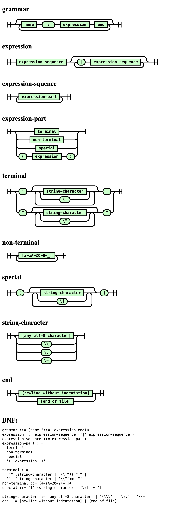

# BNF Railroad Generator

Generate a railroad diagram from BNF.

## Usage

	node bnf-railroad.mjs <infile> <outfile>

For example, to generate a `diagram.html` from this repo's [bnf.bnf](bnf.bnf) file:

	node bnf-railroad.mjs bnf.bnf diagram.html

## Screenhsot

Here's the diagram generated by [bnf.bnf](bnf.bnf):

