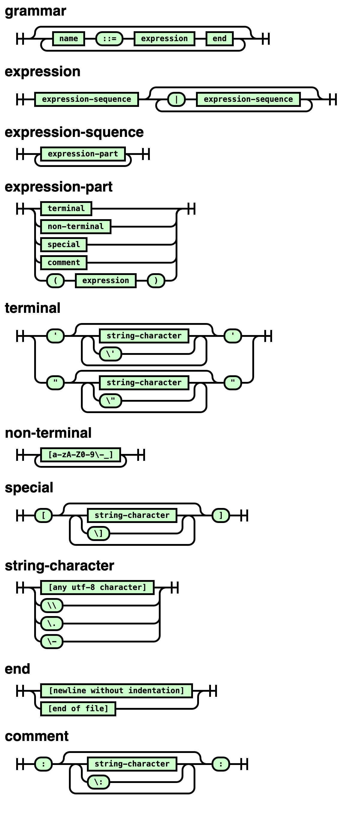

# BNF Railroad Generator

Generate a railroad diagram from BNF.

## Usage

You can install this with npm:

	npm install -g bnf-railroad

Then run it with:

	bnf-railroad <infile> <outfile>

You can also clone this repo and run the `bin/bnf-railroad.mjs` file.

## Screenhsot

Here's the diagram generated by [bnf.bnf](bnf.bnf):

